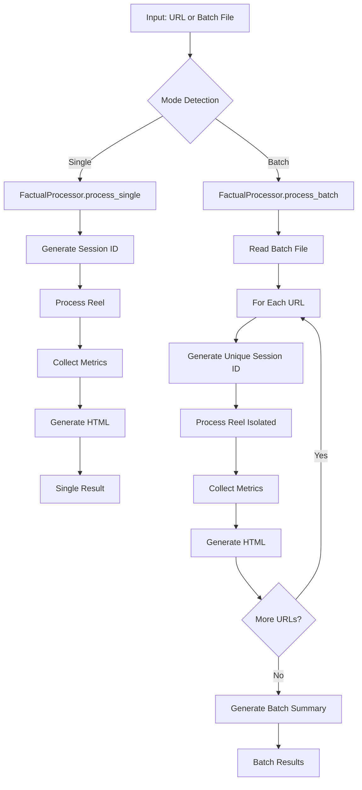

# Factual Pipeline v2.0 - Complete Refactor

## 🚨 **CRITICAL BUG FIX**

### The Problem
The original batch processing had a **session ID reuse bug** that caused all reels in a batch to overwrite each other:

```python
# OLD (BROKEN) - Session ID set once during initialization
def __init__(self, config_path=None):
    self.session_id = datetime.now().strftime("%Y%m%d%H%M%S")  # ONCE!

def process_batch(self, batch_file):
    for url in urls:
        # All URLs download to same path: temp/{session_id}/reel.mp4
        self.process_reel(url)  # OVERWRITES PREVIOUS!
```

### The Fix
```python
# NEW (FIXED) - Unique session ID per reel
def process_reel(self, url: str, session_id: str = None):
    if session_id is not None:
        self.session_id = session_id  # UNIQUE PER REEL!

def process_batch(self, batch_file):
    for line_num, url in urls:
        reel_session_id = f"{timestamp}_{line_num:03d}"  # UNIQUE!
        self.process_reel(url, session_id=reel_session_id)
```

---

## 🏗️ **NEW ARCHITECTURE**

### Core Components

1. **`unified_processor.py`** - Main interface for all processing
2. **`html_summary_generator.py`** - Rich HTML summaries + IG descriptions
3. **`engagement_tracker.py`** - Metrics collection and tracking
4. **`factual_cli.py`** - Clean command-line interface
5. **`run_factual_v2.sh`** - Enhanced shell wrapper

### Processing Flow



---

## 🎯 **NEW FEATURES**

### 1. HTML Summaries
- **Rich HTML reports** with modern styling
- **Instagram-ready descriptions** with emojis and hashtags
- **Copyable sources** for transparency
- **Responsive design** for mobile viewing

### 2. Engagement Metrics
- **Real-time metrics** collection during processing
- **Creator information** and collaborator tracking
- **Hashtag and mention** extraction
- **CSV exports** for analysis
- **Batch aggregation** statistics

### 3. Proper Session Isolation
- **Unique session IDs** per reel in batch mode
- **Isolated temp directories** to prevent file conflicts
- **Clean state management** between processing runs

### 4. Enhanced Output Structure
```
output/
├── single_20231215_143022/              # Single reel output
│   ├── factual_output.mp4
│   ├── summary.html                     # 🆕 Rich HTML summary
│   ├── instagram_description.txt        # 🆕 IG-ready description
│   ├── sources_copyable.txt            # 🆕 Copyable sources
│   ├── metrics.json                    # 🆕 Engagement metrics
│   └── manifest.json
│
└── batch_20231215_143022/              # Batch processing output
    ├── 001_ig_ABC123/                  # First reel
    │   ├── factual_output.mp4
    │   ├── summary.html
    │   ├── instagram_description.txt
    │   ├── sources_copyable.txt
    │   └── metrics.json
    ├── 002_ig_DEF456/                  # Second reel (isolated!)
    │   └── ...
    ├── batch_summary.html              # 🆕 Batch HTML report
    ├── batch_metrics.csv               # 🆕 All metrics CSV
    ├── metrics_summary.json            # 🆕 Aggregate stats
    └── batch_summary.json
```

---

## 🚀 **USAGE**

### Method 1: Enhanced Shell Script (Recommended)
```bash
# Single reel
./run_factual_v2.sh https://www.instagram.com/reel/ABC123/

# Batch processing (FIXED!)
./run_factual_v2.sh --batch urls.txt

# Use legacy mode (with bug) for comparison
./run_factual_v2.sh --legacy --batch urls.txt
```

### Method 2: Python CLI
```bash
# Single reel
python factual_cli.py https://www.instagram.com/reel/ABC123/

# Batch processing
python factual_cli.py --batch urls.txt

# Verbose output
python factual_cli.py --verbose --batch urls.txt
```

### Method 3: Direct Python API
```python
from unified_processor import FactualProcessor

# Initialize
processor = FactualProcessor()

# Single reel
result = processor.process("https://www.instagram.com/reel/ABC123/")

# Batch processing
results = processor.process("batch_urls.txt")

# Programmatic batch
urls = ["url1", "url2", "url3"]
results = processor.process(urls, mode="batch")
```

---

## 📋 **MIGRATION GUIDE**

### For Existing Scripts
1. **Replace `run_factual.sh`** with `run_factual_v2.sh`
2. **Update batch files** (no changes needed - same format)
3. **Update output parsing** to handle new directory structure

### For Python Code
```python
# OLD
from factual_pipeline import FactualPipeline
pipeline = FactualPipeline()
result = pipeline.process_batch("urls.txt")  # BUGGY!

# NEW
from unified_processor import FactualProcessor
processor = FactualProcessor()
results = processor.process("urls.txt", mode="batch")  # FIXED!
```

### For CI/CD Pipelines
- Update script paths: `run_factual.sh` → `run_factual_v2.sh`
- Parse new output structure for artifacts
- Use metrics CSV for analytics

---

## 🔧 **CONFIGURATION**

### New Config Options
```json
{
  "enable_html_summaries": true,
  "enable_engagement_tracking": true,
  "save_raw_metadata": false,
  "html_template_dir": "templates/",
  "metrics_collection_timeout": 30
}
```

### Backward Compatibility
All existing config options are preserved. New features are enabled by default but can be disabled.

---

## 🧪 **TESTING**

### Quick Test
```bash
cd MVP/factual/
python test_batch_fix.py
```

### Manual Verification
1. Create test batch file:
```
# test_urls.txt
https://www.instagram.com/reel/TEST001/
https://www.instagram.com/reel/TEST002/
```

2. Run with v2.0:
```bash
./run_factual_v2.sh --batch test_urls.txt
```

3. Verify separate output directories are created

---

## 🎯 **PERFORMANCE IMPROVEMENTS**

### Session Isolation
- ✅ **Fixed file conflicts** in batch processing
- ✅ **Parallel processing ready** (future enhancement)
- ✅ **Memory leak prevention** through proper cleanup

### Enhanced Output
- 📄 **HTML summaries** for better readability
- 📱 **Instagram descriptions** ready to copy-paste
- 📊 **Engagement tracking** for content analysis
- 📈 **Batch analytics** for performance monitoring

---

## 🚨 **BREAKING CHANGES**

### File Paths
- Batch output structure changed (new subdirectories per reel)
- New file types added (HTML, metrics, descriptions)

### API Changes
- `process_reel()` now accepts optional `session_id` parameter
- Unified processor is the new recommended interface
- Legacy pipeline still works but has the batch bug

### Dependencies
No new dependencies added - uses existing tools (yt-dlp, etc.)

---

## 🔮 **FUTURE ENHANCEMENTS**

### Ready for Implementation
1. **Parallel batch processing** - session isolation enables this
2. **Real-time progress tracking** - WebSocket updates
3. **Advanced metrics** - sentiment analysis, virality prediction
4. **Custom templates** - branded HTML outputs
5. **API endpoints** - REST API wrapper
6. **Database integration** - persistent metrics storage

### Architecture Benefits
- **Modular design** - easy to extend
- **Clean separation** - HTML, metrics, core processing
- **Testable components** - isolated functionality
- **Configuration driven** - flexible deployment

---

## 📞 **SUPPORT**

### Common Issues
1. **"All videos are the same"** → Use v2.0 processor (this fix!)
2. **"Missing HTML files"** → Check HTML generator config
3. **"No metrics collected"** → Verify yt-dlp can access URLs
4. **"Permission errors"** → Check directory permissions

### Debugging
```bash
# Verbose mode
python factual_cli.py --verbose --batch urls.txt

# Test mode
python test_batch_fix.py

# Legacy comparison
./run_factual_v2.sh --legacy --batch urls.txt  # See the bug
./run_factual_v2.sh --unified --batch urls.txt  # See the fix
```

This refactor solves the core batch processing bug while adding significant value through HTML summaries, engagement tracking, and proper architectural separation. The codebase is now ready for production batch processing and future enhancements.
